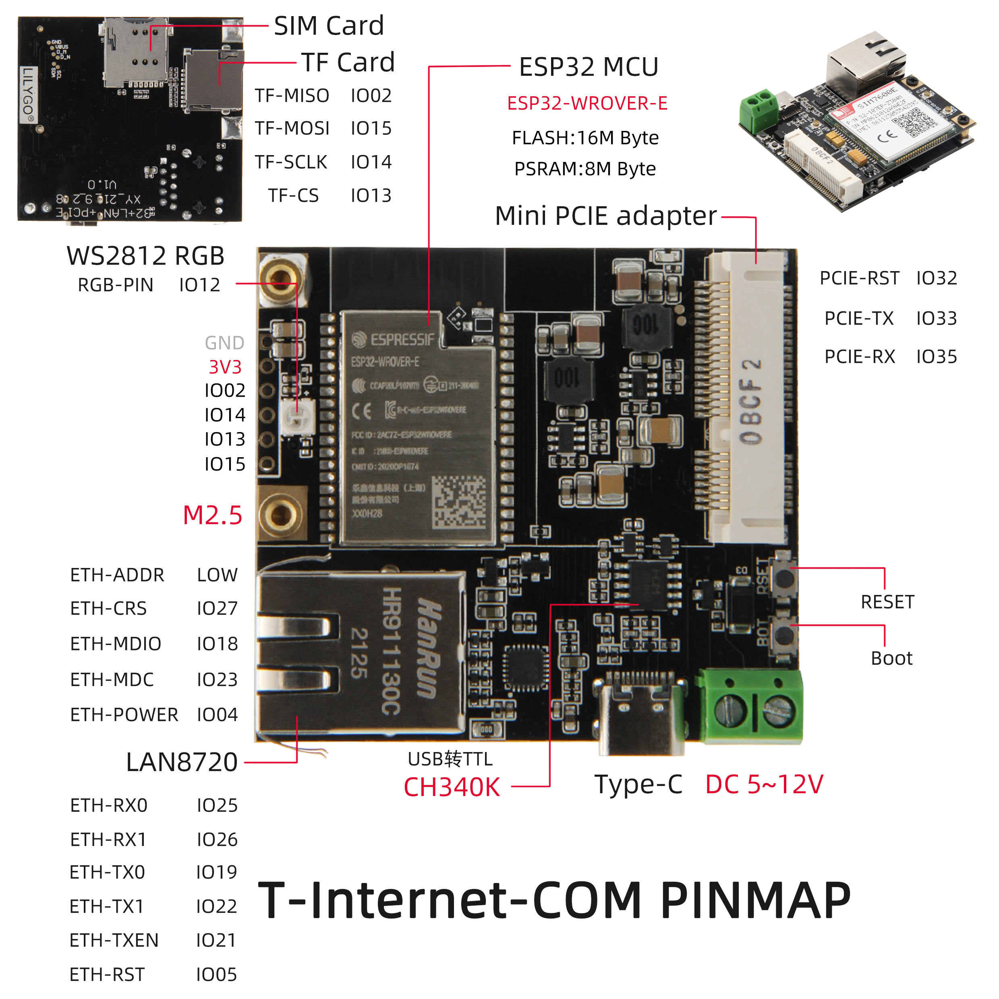

<h1 align = "center">🌟LilyGo T-Internet-COM🌟</h1>

#  Function
1. Connect to the `Ethernet`. Through the AP function of ESP32, the accessory device can be connected. You can also use a mobile phone to connect to make it function as a router.
2. Connect the `4G module` and the SIM card that can access the Internet, and enable other devices to access the network through WiFi-AP function forwarding.
3. The back of the bottom board is equipped with an SD card socket, which can be connected to an SD card or use this set of SPI to read data from other sensors, or it can be used as a normal IO.

<h3 align = "left">Product 📷:</h3>

|  Product |  Product Link |
| :--------: | :---------: |
| T-Internet-COM |  [AliExpress](https://www.aliexpress.com/item/1005003547423153.html)   |

#  Quick Start
## 1. Environmental installation

> Arduino:
>- Click "File" in the upper left corner -> Preferences -> Additional Development >Board Manager URL -> Enter the URL in the input box
> `https://raw.githubusercontent.com/espressif/arduino-esp32/gh-pagespackage_esp32_index.json`
>-  Click OK and the software will be installed by itself. After installation, restart the Arduino IDE software.

> PlatfromIO:
> - PlatformIO plug-in installation: Click on the extension on the left column -> search platformIO -> install the first plug-in
> - Click Platforms -> Embedded -> search Espressif 32 in the input box -> select the corresponding firmware installation

> ESP-IDF:
> - The installation method is also inconsistent depending on the system, it is recommended to refer to the [official manual](https://docs.espressif.com/projects/esp-idf/en/latest/esp32/get-started/index.html) for installation

